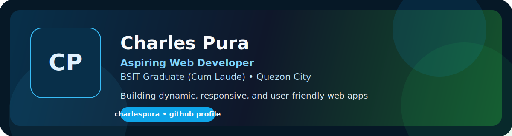

# Hi, I'm Charles Pura

## About Me

- Pronouns: **he/him**
- Based in **Quezon City**
- Interested in **Web Development**
- Currently studying **BSIT (4th Year)**
- I love building and exploring new ideas through code
- Passionate about creating **dynamic, responsive, and user-friendly web apps**
- Open to **collaboration, mentorship, and tech conversations**

## GitHub Snapshot

- Profile snapshot: **1,343 contributions in the last year**
- Active across **40+ repositories**
- Contributed to projects like **webhr3**, **charlespuraportfolio**, and **public_html**

## Technologies & Tools

### Frontend

### Backend

### Databases

### Mobile

### Tools

## GitHub Stats

  
  

  

  

## Featured Projects

  
  

  
  

  
  

## How to Reach Me

- Portfolio: [cpportfolio.onrender.com](https://cpportfolio.onrender.com)
- Facebook: [Charles Pura](https://web.facebook.com/charlespuracp)
- LinkedIn: [linkedin.com/in/charlespura](https://www.linkedin.com/in/charlespura)
- ORCID: [0009-0004-3419-8788](https://orcid.org/0009-0004-3419-8788)
- GitHub: [github.com/charlespura](https://github.com/charlespura)
- Email: [charles051902pura@gmail.com](mailto:charles051902pura@gmail.com)

## Let's Connect

I am always open to collaboration, mentorship, or just chatting about tech. If you want to build something useful together, feel free to reach out.
