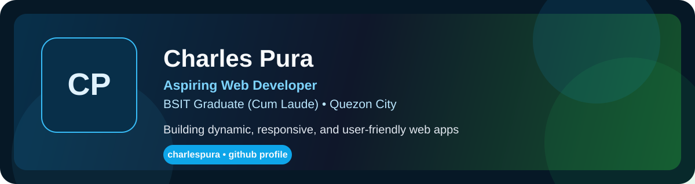

 

# Hi, I'm Charles Pura

## About Me

- Pronouns: **he/him**
- Based in **Quezon City**
- Interested in **Web Development, Software Development**
- I love building and exploring new ideas through code
- Passionate about creating **dynamic, responsive, and user-friendly web apps**
- Open to **collaboration, mentorship, and tech conversations**

## GitHub Snapshot

- Active across **88+ repositories**
- Contributed to projects like **webhr3**, **charlespuraportfolio**, and **public_html**
- Recent work includes **charlespuraportfolio**, **charlespura**, and **groq-Chatbot**
## Technologies & Tools

### Frontend

### Backend

### Databases

### Mobile

### Tools & Apps

## Deployment & Hosting

## GitHub Stats

The cards below update automatically using GitHub data and showcase my development activity, coding consistency, and open-source contributions.

- 🚀 GitHub Actions automatically generates my daily portfolio analytics report.
- 🔄 CI/CD pipeline commits the latest analytics report to this repository every day.
- ☁️ Render Auto Deploy automatically rebuilds and deploys my portfolio whenever new changes are pushed.
- 📊 Automated reporting retrieves visitor statistics from Firebase and generates a Markdown report.
- 🔥 Daily commit history reflects both ongoing development and scheduled automation that keeps the project up to date.

  
  

  

## Top Languages

Reliable fallback based on your projects and stack:

- HTML
- CSS
- JavaScript
- PHP
- TypeScript
- Java

## Featured Projects

Reliable fallback with direct links:

| Project | Tech |
| --- | --- |
| [3d-Portfolio-Free](https://github.com/charlespura/3d-Portfolio-Free) | CSS |
| [Blpc-Qr-Navigation-System](https://github.com/charlespura/Blpc-Qr-Navigation-System) | PHP |
| [Budget-Tracker](https://github.com/charlespura/Budget-Tracker) | PHP |
| [Chars-Budget-Tracker](https://github.com/charlespura/Chars-Budget-Tracker) | JavaScript |
| [chDogAdoptionManagementSystem](https://github.com/charlespura/chDogAdoptionManagementSystem) | TypeScript |
| [chIPON-CHALLENGE](https://github.com/charlespura/chIPON-CHALLENGE) | JavaScript |

## How to Reach Me

- Portfolio: [cpportfolio.onrender.com](https://cpportfolio.onrender.com)
- Facebook: [Charles Pura](https://web.facebook.com/charlespuracp)
- LinkedIn: [linkedin.com/in/charlespura](https://www.linkedin.com/in/charlespura)
- ORCID: [0009-0004-3419-8788](https://orcid.org/0009-0004-3419-8788)
- GitHub: [github.com/charlespura](https://github.com/charlespura)
- Email: [charles051902pura@gmail.com](mailto:charles051902pura@gmail.com)

## Let's Connect

I am always open to collaboration, mentorship, or just chatting about tech. If you want to build something useful together, feel free to reach out.
